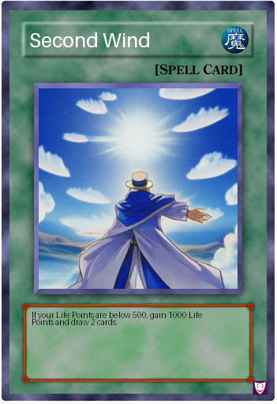
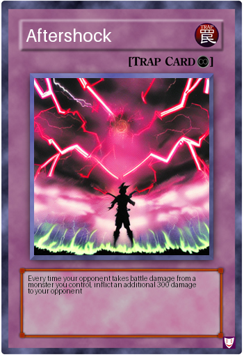

# CardCrafter

CardCrafter is an AI system that uses a multimodal model (Phi-4-multimodal-instruct, with few-shot learning) and a fine-tuned diffusion model (Stable Diffusion v1.5, fine-tuned with LoRA, a parameter-efficient fine-tuning technique) to generate images of new Yu-Gi-Oh! Spell and Trap cards.

To see how it works, see the source code and the `cardcrafter.ipynb` notebook.

To see some examples of new Yu-Gi-Oh! cards generated with CardCrafter, see the images in the `./example_generated_cards` folder. These images are also shown below.

    
    

